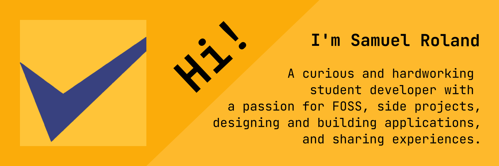

## 💻 A curious and hardworking student developer with a passion for FOSS, side projects, designing and building applications, and sharing experiences.

### 🖥️ 🙂 Current projects
1. [**Delibay**](https://delibay.org): An open-source learning platform based on deliberate practice principles for IT students and their teachers, focused on practice and feedback. I develop it on [codeberg.org](https://codeberg.org/delibay) to avoid Github.

**Important**: Actually I do most of my code, except for school, on [codeberg.org](https://codeberg.org/samuelroland), you won't see anything new exceptional things here...

## Archived
1. [**KanFF**](https://github.com/samuelroland/KanFF#readme) - **An opensource web application to manage projects with kanban boards, for groups, collectives, and associations.**  
*A fascinating project to help manage other projects inside more or less big collectives.*
1. [**openDevApps**](https://github.com/samuelroland/openDevApps#readme) - **Open quickly local or remote development-related apps, through a small list of links.**  
*My first web extension built with VueJS and Tailwindcss as a solution for a personal need. The extension is published on [addons.mozilla.org](https://addons.mozilla.org/firefox/addon/opendevapps) and licenced under GNU GPLv3+.*
1. [**docs**](https://github.com/samuelroland/docs#readme) - **Personal documentation and notes about programming languages, resource lists, or created files. Mostly in french.**  
*The goal is to write down and vulgarize the things I learn, to memorize and understand them better, and at the same time also help other developers in their learnings...*
